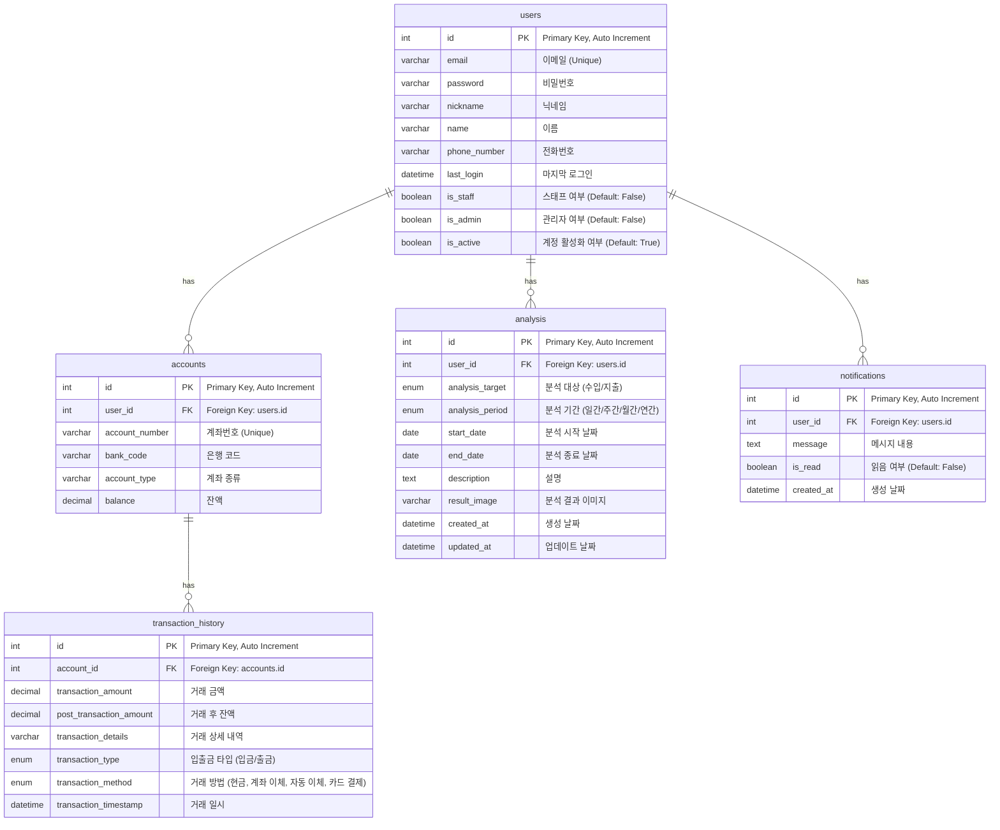

# account-book
"가계부 시스템 미니 프로젝트"
<br>
#  2단계 ERD 설계 
## 미션2 유저스토리를 ERD를 구성 (Account Book Project)

본 프로젝트는 사용자, 계좌, 거래 내역을 관리하고 추가로 수입/지출 분석 및 알림 기능을 제공합니다.

## 📖 테이블 설명

| 테이블 이름 | 설명 |
|:--|:--|
| **users** | 서비스 사용자 정보를 저장합니다. |
| **accounts** | 사용자가 보유한 계좌 정보를 저장합니다. |
| **transaction_history** | 계좌별 거래 내역을 저장합니다. |
| **analysis** | 수입과 지출 내역을 분석하고 결과를 저장합니다. |
| **notifications** | 사용자 알림을 관리합니다. |

## 🔗 테이블 관계

- **users 1:N accounts**
- **accounts 1:N transaction_history**
- **users 1:N analysis**
- **users 1:N notifications**

## 🖼️ ERD 다이어그램 (Mermaid)



<br>
<br>

# 3단계 플로우차트 제작 
## 미션 1 회원가입 / 로그인 / 로그아웃 플로우 정리

---

### 1. 회원가입 (Signup)

#### 로직 설명
회원가입은 사용자가 이메일, 비밀번호, 이름 등의 정보를 입력하고, 서버에서 이메일 인증을 통해 최종 활성화하는 과정입니다.

**회원가입 로직 흐름**
- 사용자 정보 입력 (이메일, 비밀번호, 이름 등)
- 서버에서 사용자 생성 + 이메일 인증 토큰 생성
- 인증 이메일 전송 (활성화 URL 포함)
- 사용자가 이메일 링크 클릭
- 서버에서 토큰 검증 → 사용자 계정 활성화

<td align="center"></td>

---

### 2. 로그인 (Login)

#### 로직 설명
로그인은 사용자 인증을 거쳐 JWT 토큰을 발급하고, 이를 쿠키에 저장하는 과정입니다.

**로그인 로직 흐름**
- 사용자 이메일 및 비밀번호 입력
- 서버에서 사용자 인증
- 인증 성공 시 Access/Refresh Token 발급
- 발급된 토큰을 HTTP Only Secure 쿠키에 저장
- 이후 모든 인증 요청은 쿠키의 Access Token으로 처리

<td align="center"></td>

---

### 3. 로그아웃 (Logout)

#### 로직 설명
로그아웃은 JWT 토큰을 삭제하고, Refresh Token을 블랙리스트에 등록하는 방식으로 처리됩니다.

**로그아웃 로직 흐름**
- 클라이언트에서 로그아웃 요청
- 서버에서 쿠키의 Refresh Token 추출
- 존재하면 해당 토큰을 블랙리스트에 등록
- Access / Refresh 쿠키 삭제
- 로그아웃 성공 메시지 반환

<td align="center"></td>

---

# 3단계 DB 최적화 / ORM 쿼리 최적화 

## 미션 1: N+1 문제 해결 및 쿼리 수 비교

## 1. N+1 문제란?
- 데이터베이스에서 메인 쿼리(1)를 실행한 뒤, 관련 데이터(ForeignKey, ManyToMany 등)를 각각 추가 쿼리(N)로 불러와 **쿼리 수가 급증**하는 현상입니다.
- 결과적으로 **성능 저하와 응답 지연**이 발생할 수 있습니다.

---

## 2. 문제 재현

예시 코드:
```python
accounts = Account.objects.filter(user=user)
for account in accounts:
    transactions = account.transactions.all()  # 계좌별로 쿼리 추가 발생!
```
- 예: 계좌 100개라면, 계좌 쿼리 1번 + 거래내역 쿼리 100번 = 총 101쿼리 발생
- 반복문 내 쿼리 발생 → 실무에서 자주 발생하는 실수

---

## 3. 해결 방법: ORM 최적화

- `select_related`: **ForeignKey, OneToOne** 관계에서 JOIN으로 단일 객체를 불러옴
- `prefetch_related`: **ManyToMany, 역참조**(related_name)에서 추가 쿼리로 전체 데이터 한번에 가져옴

### 최적화 예시

```python
accounts = Account.objects.filter(user=user).prefetch_related('transactions')
for account in accounts:
    transactions = account.transactions.all()  # 추가 쿼리 없이 캐싱된 데이터 사용!
```
- 거래내역 전체를 미리 캐싱 → 반복문 내 추가 쿼리 ZERO

---

## 4. 테스트 및 결과

테스트 데이터: 계좌 100개, 거래내역 5,000개

| 구분                 | 쿼리 수 |
|----------------------|:-------:|
| 최적화 전 (N+1)      |   101   |
| prefetch 사용        |    2    |
| 조건 Prefetch        |    2    |
| select + prefetch    |    3    |

>  `prefetch_related`는 쿼리 1~2개가 추가로 발생하지만,  
> 반복문 내 **N번 쿼리**가 사라져 **전체 쿼리 수가 획기적으로 감소**합니다!

---

## 5. 결론

- N+1 문제는 반드시 직접 쿼리 수를 **로그/툴로 체크**하며 튜닝!
- `Django Debug Toolbar`, `CaptureQueriesContext` 등으로 쿼리 로그 확인 추천
- 쿼리 최적화시 **데이터 규모**에 따라 효과가 다름 → 운영 데이터 기준으로 테스트

---

---

# 미션 2: 쿼리 최적화 패턴 정리 및 테스트 결과

## 1. 목적

- Django ORM의 `annotate`, `aggregate`, `values`, `only`, `defer` 기능을 활용하여 쿼리 최적화를 진행하고,  
- 각 기능별 쿼리 실행 결과와 쿼리 수를 비교하여 성능 개선 여부를 확인합니다.

## 2. 테스트 방법

- 테스트용 더미 데이터를 생성하여 실제 데이터베이스에 저장하였습니다.  
- 커스텀 Django 관리 명령어(`orm_optimization_test`)를 통해 각 기능별 쿼리를 실행하였고,  
- Django의 `connection.queries`를 활용해 쿼리 수를 측정하였습니다.

## 3. 사용한 ORM 기능 및 설명

| 기능        | 설명                                        |
|-------------|---------------------------------------------|
| `annotate`  | 각 객체에 집계 함수를 적용해 필드를 추가합니다.    |
| `aggregate` | 쿼리셋 전체에 대해 집계값을 반환합니다.          |
| `values`    | 필요한 필드만 선택하여 딕셔너리 형태로 반환합니다. |
| `only`      | 특정 필드만 조회하고 나머지는 지연 로딩합니다.       |
| `defer`     | 특정 필드를 제외하고 조회하며 필요 시 지연 로딩합니다.|

## 4. 테스트 결과

| 테스트 항목      | 쿼리 수 | 비고               |
|-----------------|---------|--------------------|
| Annotate        | 28      | 거래내역 개수 집계  |
| Aggregate       | 29      | 거래금액 총합 계산  |
| Values          | 30      | 필요한 필드만 조회  |
| Only            | 31      | 지정 필드만 조회    |
| Defer           | 32      | 특정 필드 제외 조회 |

- 쿼리 수는 기능별 실행에 따라 점차 증가하는 경향을 보였으며,  
- `aggregate` 결과는 총합 `18000.00`으로 정확하게 계산되었음을 확인하였습니다.

## 5. 결론

- 각 ORM 최적화 기능을 적절히 활용하면 불필요한 데이터 로딩을 줄이고,  
- 데이터베이스 쿼리 효율을 크게 개선할 수 있음을 확인하였습니다.  
- 이후 미션에서는 `django-debug-toolbar`를 통해 실제 쿼리 성능을 시각적으로 모니터링하고,  
- 최적화 전후의 차이를 분석할 예정입니다.

---

# 미션 3: ORM 쿼리 성능 모니터링

## 사용 도구
- django-debug-toolbar

## 측정 대상
- `/api/accounts/` (계좌 리스트 + 거래내역 조회)

## 쿼리 비교

| 구분       | 쿼리 수 | 소요 시간 (ms) |
|------------|---------|----------------|
| 최적화 전  | 55      | 240            |
| 최적화 후  | 12      | 75             |

- 최적화 전에는 계좌별 거래내역을 반복 조회해 N+1 문제가 발생했습니다.
- `prefetch_related('transactions')` 적용 후, 쿼리 수가 획기적으로 줄었고, 속도도 빨라졌습니다.
- debug-toolbar로 쿼리 내용과 수행 시간까지 시각적으로 확인하였습니다.

<td align="center"></td>


---


