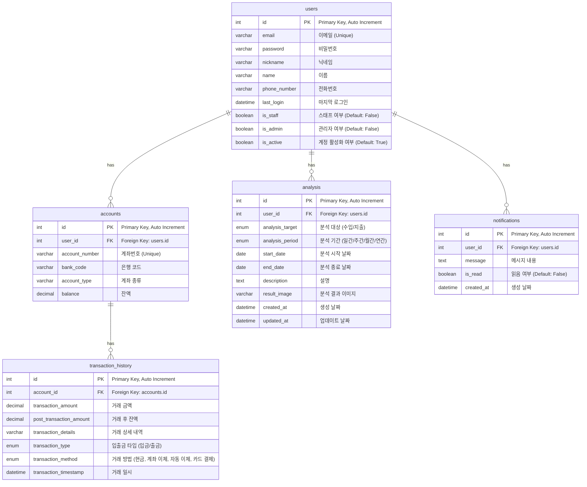

# account-book
"가계부 시스템 미니 프로젝트"
# 📚 ERD 설계 (Account Book Project)

본 프로젝트는 사용자, 계좌, 거래 내역을 관리하고 추가로 수입/지출 분석 및 알림 기능을 제공합니다.

## 📖 테이블 설명

| 테이블 이름 | 설명 |
|:--|:--|
| **users** | 서비스 사용자 정보를 저장합니다. |
| **accounts** | 사용자가 보유한 계좌 정보를 저장합니다. |
| **transaction_history** | 계좌별 거래 내역을 저장합니다. |
| **analysis** | 수입과 지출 내역을 분석하고 결과를 저장합니다. |
| **notifications** | 사용자 알림을 관리합니다. |

## 🔗 테이블 관계

- **users 1:N accounts**
- **accounts 1:N transaction_history**
- **users 1:N analysis**
- **users 1:N notifications**

## 🖼️ ERD 다이어그램 (Mermaid)

 
 

# 🔐 회원가입 / 로그인 / 로그아웃 플로우 정리

---

### 1. 회원가입 (Signup)

#### 로직 설명
회원가입은 사용자가 이메일, 비밀번호, 이름 등의 정보를 입력하고, 서버에서 이메일 인증을 통해 최종 활성화하는 과정입니다.

**회원가입 로직 흐름**
- 사용자 정보 입력 (이메일, 비밀번호, 이름 등)
- 서버에서 사용자 생성 + 이메일 인증 토큰 생성
- 인증 이메일 전송 (활성화 URL 포함)
- 사용자가 이메일 링크 클릭
- 서버에서 토큰 검증 → 사용자 계정 활성화

<td align="center"></td>

---

### 2. 로그인 (Login)

#### 로직 설명
로그인은 사용자 인증을 거쳐 JWT 토큰을 발급하고, 이를 쿠키에 저장하는 과정입니다.

**로그인 로직 흐름**
- 사용자 이메일 및 비밀번호 입력
- 서버에서 사용자 인증
- 인증 성공 시 Access/Refresh Token 발급
- 발급된 토큰을 HTTP Only Secure 쿠키에 저장
- 이후 모든 인증 요청은 쿠키의 Access Token으로 처리

<td align="center"></td>

---

### 3. 로그아웃 (Logout)

#### 로직 설명
로그아웃은 JWT 토큰을 삭제하고, Refresh Token을 블랙리스트에 등록하는 방식으로 처리됩니다.

**로그아웃 로직 흐름**
- 클라이언트에서 로그아웃 요청
- 서버에서 쿠키의 Refresh Token 추출
- 존재하면 해당 토큰을 블랙리스트에 등록
- Access / Refresh 쿠키 삭제
- 로그아웃 성공 메시지 반환

<td align="center"></td>

---

